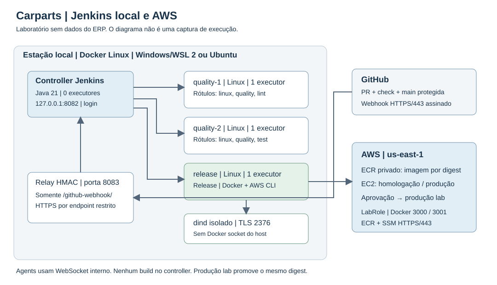

# Prática Carparts: Jenkins com AWS

Lucca Castilho Costa | RA 26179873 | 2ADS

A substituição de Azure por AWS foi autorizada pelo professor, conforme informado pelo aluno. A aplicação usa somente dados fictícios. Serviços Azure do material original foram substituídos por ECR e EC2.

## E1. Arquitetura e custo

| Componente | Local e sistema | Execução e comunicação |
|---|---|---|
| Controller | Docker Linux em Windows/WSL 2 | Zero executores; interface 127.0.0.1:8082 |
| quality-1 | Docker Linux local | Um executor; linux, quality, lint; WebSocket interno |
| quality-2 | Docker Linux local | Um executor; linux, quality, test; WebSocket interno |
| release | Docker Linux local | Um executor; Docker e AWS CLI; HTTPS para ECR e SSM |
| Docker daemon | dind separado | TLS/2376 interno, sem socket do host nem porta publicada |
| Relay | Container Node local | HMAC e repositório verificados; túnel HTTPS somente para webhook |
| ECR | us-east-1 | Registro privado carparts-api; tags imutáveis e digest |
| EC2 | Amazon Linux 2023, t3.micro | LabRole e SSM; homologação 3000 e produção de laboratório 3001 |

As estações Ubuntu do cenário empresarial podem receber agents Linux. Windows nativo seria usado apenas para dependência específica, não para esta API Node. Não é necessário um agent por integrante. A escolha local depende da estação ligada e reduz o custo cloud. Os ambientes na mesma EC2 não representam isolamento empresarial.

Estimativa em us-east-1, Linux sob demanda, 730 horas/mês e um IPv4 por instância:

| Parcela | Jenkins local + uma EC2 | Jenkins em segunda EC2 + aplicação |
|---|---:|---:|
| t3.micro, US$ 0,0104/h | US$ 7,59 | US$ 15,18 |
| gp3, 8 GiB/instância, US$ 0,08/GiB/mês | US$ 0,64 | US$ 1,28 |
| IPv4, US$ 0,005/h | US$ 3,65 | US$ 7,30 |
| ECR, hipótese 1 GiB, US$ 0,10/GiB/mês | US$ 0,10 | US$ 0,10 |
| Subtotal | US$ 11,98 | US$ 23,86 |
| Reserva proposta para adicionais | US$ 20,00 | US$ 20,00 |
| Total de planejamento | US$ 31,98 | US$ 43,86 |

Não são faturas. Energia e manutenção local não foram monetizadas. Impostos, tráfego, créditos de CPU e crescimento do registro podem alterar o total. O segundo cenário é comparativo: t3.micro pode ser insuficiente para o controller e exige teste de capacidade. Não criamos segunda instância. O teto do exercício é US$ 150, mas o Learner Lab tem limite próprio, possivelmente menor. Não confundir crédito estudantil com ausência de cobrança.

Preços consultados em 28/09/2026: [EC2 T3](https://aws.amazon.com/ec2/instance-types/t3/), [EBS](https://aws.amazon.com/ebs/volume-types/), [IPv4](https://aws.amazon.com/vpc/pricing/) e [ECR](https://aws.amazon.com/ecr/pricing/).

## E2. Controller reprodutível

`jenkins/Dockerfile`, `plugins.txt` e `casc.yaml` reproduzem Jenkins LTS 2.568.3 com Java 21, plugins versionados e SHA-256 conferidos no Update Center. O controller tem volume persistente, zero executores, autenticação, autorização por papéis, CSP e nomes restritos. Não há acesso anônimo de uso.

Os três agents conectaram por WebSocket. As dependências incompatíveis foram corrigidas com backup prévio. Isso demonstra atualização de plugins, não migração testada entre versões diferentes do core LTS. O backup sensível, senhas, PEM e caches ficam fora da entrega. O JENKINS_HOME não é montado nos agents.

## E3. Pipeline

`Jenkinsfile.ci` executa lint e testes em paralelo e publica JUnit. `Jenkinsfile.aws` executa fonte, qualidade, preflight, construção, ECR, homologação, aprovação e produção. Usa agent none, when, timeout e post. A aprovação registra identidade, horário e digest sem ocupar executor. A fonte é capturada uma vez e distribuída por stash.

Oito testes Node e seis testes Python passaram. A build 3 foi somente preflight, não implantação. Builds 1 e 2 falharam antes do deploy por PATH e permissão de credenciais; as causas foram corrigidas e o histórico preservado. Builds 4 e 5 implantaram versões reais. A mesma imagem por digest é promovida sem rebuild, e o smoke exige status e commit esperados.

A CI roda como ci-user e não recebe segredos AWS. A release roda como release-manager e usa credenciais somente da pasta carparts-release. Job: http://localhost:8082/job/carparts-release/job/aws-release/

## E4. AWS e rollback

ECR: `667230721680.dkr.ecr.us-east-1.amazonaws.com/carparts-api`.

EC2: `i-0530d8af368032276`, us-east-1; IPv4 observado `100.26.3.226`, sujeito a mudança após reinício.

Homologação: http://100.26.3.226:3000/health

Produção de laboratório: http://100.26.3.226:3001/health

Jenkins usa credenciais temporárias no cofre. O comando remoto SSM não recebe chaves: EC2 autentica pelo LabRole. Login Docker usa configuração temporária removida ao final. LabRole é fornecido pelo laboratório e não comprova privilégio mínimo personalizado; suas políticas não foram alteradas.

Build 4 promoveu o digest `sha256:1456565b4957a24dcf84e88ddfb9892d9aaa9f89164e912af2efd837e88b5daa`, commit `417bbef801d6ab54eea0bc9b64361c09ce531477`, nos dois ambientes. Build 5 criou versão posterior e build 6 restaurou a versão anterior real, sem rebuild, com aprovação e smoke. Artefatos JSON registram versões, horários e comandos SSM.

As aprovações do ensaio foram registradas como admin sob autorização do aluno, não como revisão independente de colega ou montadora. HTTP é exclusivo desta demonstração sem dados reais. Uso empresarial exige TLS, isolamento e revisão de rede. Credenciais compartilhadas devem ser substituídas.

## E5. GitHub e webhook

Repositório: https://github.com/luccalck/carparts-jenkins

PR: https://github.com/luccalck/carparts-jenkins/pull/1

O Multibranch carparts-ci descobre branches e PRs e usa Jenkinsfile.ci. Actions publica o check testes com permissão de leitura. O webhook recebe push e pull_request; o ping retornou HTTP 200. O relay verifica HMAC, repositório, método, caminho e tamanho antes de encaminhar ao Jenkins interno. O túnel é temporário, não infraestrutura empresarial de alta disponibilidade.

O comentário do PR é revisão técnica do ensaio, não aprovação independente de colega. O check Actions não é status publicado pelo Jenkins. A publicação automática de status Jenkins requer credencial GitHub restrita e integração própria; não expusemos o token amplo da sessão local à CI de PRs. A proteção aplicada e as entregas do webhook estão registradas nas evidências. Não alegar atendimento integral a E5 sem revisão independente e status Jenkins.

## E6. Métricas e melhoria

`metrics/runs.csv` deve ser preenchido com builds reais e artefatos de produção/rollback. O calculador exige dez execuções, rejeita duplicatas e diferencia teste falho de incidente após deploy. A consolidação, quando concluída, fica em `metrics/resultados.json`. Cada horário deve corresponder ao Jenkins ou ao comando SSM, nunca a uma simulação.

São repetições de laboratório. Frequência diária extrapolada de janela curta não representa a empresa. Ausência de incidente no smoke imediato não prova ausência de falhas em uso prolongado. Falhas anteriores à publicação não contam como falha de mudança.

Referência: lead time de 11 dias; meta de até 2 dias em dois meses. Semana 1: CI reproduzível abaixo de 15 minutos. Semana 2: promoção por digest e rollback. Semanas seguintes: registrar esperas de revisão e aprovação, revisar a mediana semanalmente e reduzir o maior gargalo sem eliminar controles. Revisão em até um dia útil é meta proposta, não resultado comprovado.

A estimativa cabe em US$ 150, mas é necessário acompanhar consumo real e limite estudantil. Não há prova de alerta/orçamento AWS criado nem observação empresarial por dois meses. A amostra não permite garantir nota máxima ou ganho real da equipe.

## Evidências

Na pasta irmã `evidencias/aws/`: logs reais `jenkins-aws-build-N.txt`, metadados, JSON de homologação, produção, rollback e respostas SSM. O diagrama é ilustração arquitetural, não captura. Não foram produzidos prints fictícios.
